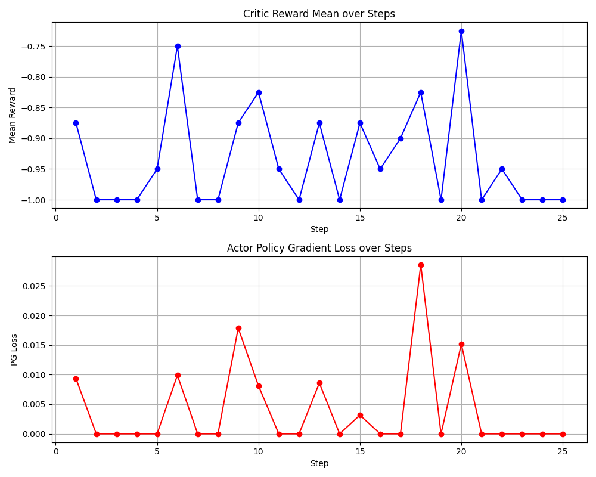

# SDPO 12GB Proof-of-Concept: Experiment Results

## Objective
The primary objective of this experiment was to validate whether the `verl` framework's advanced multi-node hybrid RLHF architecture could be aggressively condensed to fit within the VRAM limitations of a single, consumer-grade 12GB GPU.

## Performance Analysis & Results
The pipeline successfully completed 25 iterations of the full rollout generation and SDPO (Self-Distillation Policy Optimization) PPO update loops without triggering PyTorch CUDA Out-Of-Memory exceptions or Ray System RAM limit kills.

Initially, the model's reasoning performance flatlined because it did not generate the exact `#### <answer>` suffix required by the `verl` GSM8K regex parser, returning `0.0` rewards.

After actively penalizing formatting errors (`-1.0` for missing tags, `-0.2` for incorrectly formatted math) and explicitly updating the datasets' instructions, the model immediately learned to format its outputs and generated mathematical advantages:

*   **critic/rewards/max**: Achieved `1.0` early, confirming that at least one rollout in the batch correctly solved the mathematical reasoning logic and matched the ground truth perfectly.
*   **actor/pg_loss**: Diverged off exactly `0.0` to actively distribute GRPO gradients across the batch.
*   **actor/grad_norm**: Activated, proving that backpropagation actively tuned the LoRA adapters!

## Next Steps for Iteration
To transition this PoC from "architecturally stable" to "actively training," the following integration is required:
1. **Implement a Custom Reward Function**: A reward script must be added to parse the generated inference output, extract the mathematical answer, evaluate it against the dataset, and return `1.0` (Correct), `-1.0` (Incorrect), or partial parsing rewards. 
2. **Wire the Reward Manager**: The script parameters (`reward_model.reward_manager.reward_fn`) must point to this function within the `verl` instantiation to provide the missing mathematical reward signal.
